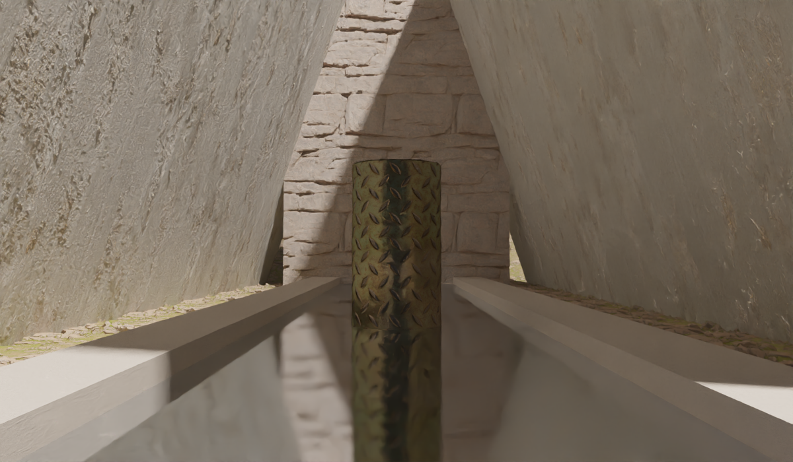
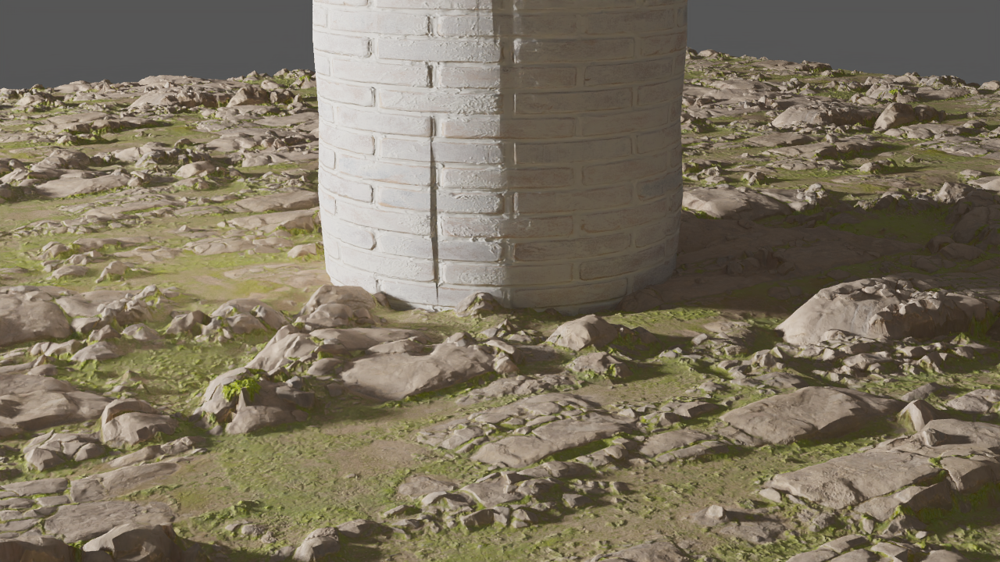
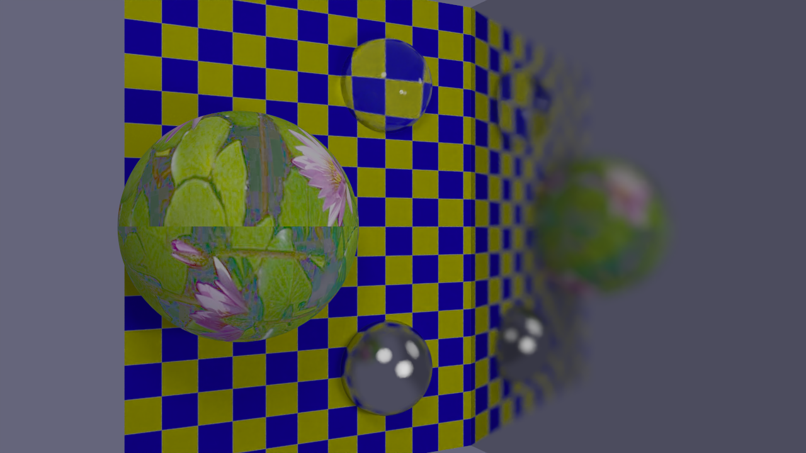

# A Raytracer Written in Rust

A multithread raytracer written in Rust by Adalie Ahuja








## Getting Started

This project uses some nightly Rust features, so you'll need to use latest nightly version of Rust.

### Installing Rust

If you don't have Rust installed, you can install it using `rustup`:

```bash
curl --proto '=https' --tlsv1.2 -sSf https://sh.rustup.rs | sh
```

This will install `rustup`, the Rust toolchain manager. Then, you can install the nightly toolchain:

```bash
rustup toolchain install nightly
rustup default nightly
```

### Building and Running

There are two primary ways to build and run this project: using the provided Docker development environment, or setting up everything on your local machine.

Or if you wish you can skip installing OIDN and use the `--no-default-features` with cargo to skip requiring it as a dependency (see below for details)

#### Option 1: Using Docker (Recommended)

The easiest way to get started is to use the provided Docker-based development environment. This will ensure you have all the correct dependencies and configuration.

1.  **Install Docker and Docker Compose:** Make sure you have Docker and Docker Compose installed on your system.
2.  **Open in VS Code:** If you have Visual Studio Code and the "Remote - Containers" extension installed, you can simply open the project folder and VS Code will prompt you to reopen it in a container. This will automatically build the Docker image and set up the environment for you.
3.  **Manual Docker Build:** Alternatively, you can build and run the development container manually:

    ```bash
    docker-compose up -d dev
    ```

    You can then get a shell inside the container with:

    ```bash
    docker-compose exec dev bash
    ```

Once inside the container, you can build and run the project as you would locally.

#### Option 2: Local Setup

If you prefer to set up the development environment on your local machine, you will need to install the Open Image Denoise (OIDN) library.

##### Installing OIDN

You can download the pre-compiled binaries for your system from the [OIDN releases page](https://github.com/OpenImageDenoise/oidn/releases). For Linux, you can use the following commands:

```bash
wget https://github.com/RenderKit/oidn/releases/download/v2.3.3/oidn-2.3.3.x86_64.linux.tar.gz
tar -xvf oidn-2.3.3.x86_64.linux.tar.gz
```

You will then need to set the `OIDN_DIR` environment variable to the path of the extracted OIDN directory.

##### Running the Project

Once you have Rust and OIDN installed, you can build and run the project using `cargo`:

```bash
cargo run --release
```

To see the help menu for all available options:

```bash
cargo run --release -- --help
```

### Disabling Denoising (OIDN)

If you wish to build the project without the OIDN dependency, you can do so by disabling the default `denoise` feature. 
This can be useful if you are having trouble installing OIDN or if you want a lighter build for testing.

To build without the `denoise` feature, use the `--no-default-features` flag with `cargo`:

```bash
cargo run --release --no-default-features
```
## Finding things
- Scenes are in `./scenes`
- Output files are in `./output`
- Executables are in the `./releases` folder
  - Note: Where you run the executable from isn't important as textures load relative to the scene file.
  - Note: Use `.\target\debug\raytracer.exe --help` to see the command line interface
- The `brutalist` & `pbr_test` scenes are animated

## Extra Credit Work
- Animation
  - All Vec3, Vec2, & f32 properties can be animated with the following syntax
    - `Interpolation {p1 t1, p2 t2, ...}`
    - In paractice this will look something like: `Linear { (-4 2 6) 0, (-8 2 6) 3 }`
      - This is doing a linear transformation from `(-4 2 6)` at `t=0` to `(-8 2 6)` at `t=3`
    - See `./scenes/tess_test.ray` for usage examples
  - Global animations proerties are defined in an `AnimationSettings` block:
  ```
  AnimationSettings {
    duration 3
    frameRate 30
  }
  ```

- Denoising with OIDN (Open Image Denoise)
  - Significantly reduces the number of samples required to get pretty images
    - Even 1 sample/pixel can get nice looking results! Useful for test renders
  - Also rendering normals & albedo values to improve denoising quality
  - Can be seen as the `_albedo`, `_normal`, & `_noisy` images
- Anitialiasing
- Tonemapping
  - Implemented basic tonemaping from the internal linear HDR image to the final SDR image.
  - Applies gamma correction as well
- BVH Tree utilized
  - Implemented a crate for creating BVH trees to optimize performance. 
  - Significantly speeds up rendering when there are many triangles (as a result of below)
- Normal Maps
- Displacement maps
  - Uses displacement maps to create much more detailed geometry on triangles
  - Displaced geometry is implemented as part of the loader and is created during this stage.
- Recursive render
  - A PBR raytracer creates really pretty scenes
- Next Event Estimation (NEE)
  - Trace additional rays towards light on every bounce on a lambertian surface.
  - Handled in an energy correct way
  - Similar to the idea of shadow rays from the assignment
- Lights are real objects and have volume
  - NEE rays trace to a random point on the light
  - Bounce rays can physically hit the light
  - Creates nice soft shadows on objects
- No ambient light
  - All ambient lighting happens through random bounce lighting
  - Looks much better
- Multithreaded
  - Rendering work is on a row by row basis utilizing the rayon library
  - Can use all your CPU cores.
- Performant!
  - BVH trees and optimized Rust code can calculate 11.5 million ray intersections / second in a scene with ~550k triangles
  - Simpler scenes can reach as high as 200 million ray intersections / second (with BVH trees disabled)
- Easy to use command line interface
- Rust
  - All original memory safe code written by me in Rust

# Credits
## Textures:
https://polyhaven.com/a/laminate_floor_02
https://polyhaven.com/a/painted_plaster_wall
https://polyhaven.com/a/whitewashed_brick
https://polyhaven.com/a/rocky_terrain
https://polyhaven.com/a/dry_riverbed_rock
https://polyhaven.com/a/gravelly_sand
https://polyhaven.com/a/plank_flooring_03
https://polyhaven.com/a/cobblestone_pavement
https://polyhaven.com/a/dirty_concrete
https://polyhaven.com/a/coral_fort_wall_02
https://polyhaven.com/a/metal_plate
https://polyhaven.com/a/plastered_wall


## AI usage

Some repetative, non-raytracer code was written with the help of AI, namely:

- Some of `./src/loader/file_format.rs`
- Most of `./src/loader/parser.rs` -- Code in that parses the `.ray` files into a friendly format to use in rust.
- The `./render_to_video.py` script to encode the final video into an mp4.
- The `./scenes/textures/compress_exr.py` to re-encode exr files into a format the `image` crate can decode.
- Some stuff regarding the devcontainer & Dockerfile
- Some other small instances & to help with debugging in some cases.
